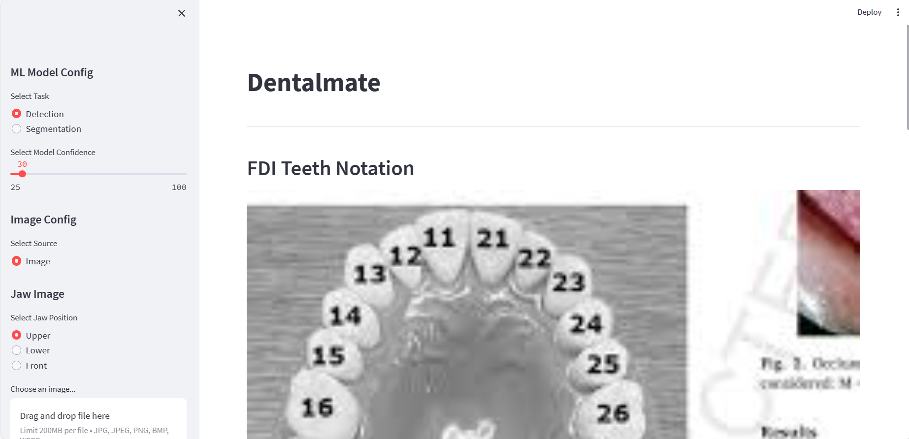

# Dental Mate

This repository contains streamlit app and flask api with python 3.9.18

## Demo WebApp

The demo Web App using streamlit

## Installation

1. Clone the repository:

```
git clone https://github.com/your_username/object-detection-app.git
```

2. Install the requirements

```
pip install -r requirements.txt
```

3. Download the models from [Google Drive](https://codingmantras-yolov8-streamlit-detection-tracking-app-njcqjg.streamlit.app/) and place in into weights

4. To Run streamlit webapp

```
streamlit run app.py
```

5. To Run Flask server

```
python api.py
```

#### API Endpoint

- **URL**: `/upload-front`
- **Method**: POST

- **URL**: `/upload-upper`
- **Method**: POST

- **URL**: `/upload-lower`
- **Method**: POST

#### Request Parameters

- `image`: (required) The image file to perform object detection on. Supported formats: JPEG, PNG.

#### Response

The response contains a JSON object with the following fields:

- `another_disease`: another disease that captured by the model that doesnt belong to a teeth eg. teeth gap
- `image`: image url
- `image_height`: image height
- `image_width` : image width
- `teeth_data` : data related to each teeth
  - `centroid` : center of the teeth
  - `mask` : teeth mask
  - `mask_shape` : mask shape
  - `teeth_disease` : detected teeth disease (from object detection model)
  - `teeth_disease_coord` : coordinate of the detected teeth disease
  - `teeth_disease_seg` : detected teeth disease (from segmentation model)
  - `teeth_disease_seg_conf` : confidence of the segmentation results
  - `teeth_disease_seg_coord` : coordinate of the segmentation disease

Example Response Lower/Upper:

```json
{
    "another_disease": {},
    "image": "http://localhost:5000/output/1708970452.png",
    "image_height": 1688,
    "image_width": 3000,
    "teeth_data": {
        "11": {
            "centroid": [
                1281,
                279
            ],
            "mask": [],
            "mask_shape": [
                1688,
                3000,
                1
            ],
            "teeth_disease": [],
            "teeth_disease_coord": [],
            "teeth_disease_seg": [],
            "teeth_disease_seg_conf": [],
            "teeth_disease_seg_coord": []
        },
        "12":{
            ....
        }
        ...
    }
}
```

Example Response Front:

```json
"another_disease": {},
"image": "http://localhost:5000/output/1708975144.png",
"image_height": 1688,
"image_width": 3000,
"teeth_data": {
    "11": {
        "centroid": [
            1338,
            734
        ],
        "mask": [],
        "mask_shape": [
            1688,
            3000,
            1
        ],
        "teeth_disease": [],
        "teeth_disease_coord": [],
        "teeth_disease_seg": [],
        "teeth_disease_seg_conf": [],
        "teeth_disease_seg_coord": []
    },
    "12":{
        ...
        },
    ...
}
```

## Demo Pics

### Home page



### Note

I have added some inference result from Graha Natura Clinic Picture [Google Drive](https://docs.google.com/spreadsheets/d/1SfB8VmiBoTTodtUWKGMA5UIdtzmCpgH8sZzLuObmEb0/edit#gid=1056799006)

Graha Natura Before Pic [Air Table](https://airtable.com/appdHxBfw6UPxDGHd/tbl08PwjfvUcK1Wh2/viwGj52cEaJFwdnsp/recofR0FNJoU0pgpW/fld6FVqzkVLqkC9eh/att8xRRy4t4IOBzpV?blocks=hide)

## Improvement Areas

- Improve training data
- Improve detection process -> crop each photo and classify the disease

If there any questions you can email me at gabrieltama777@gmail.com Thanks
