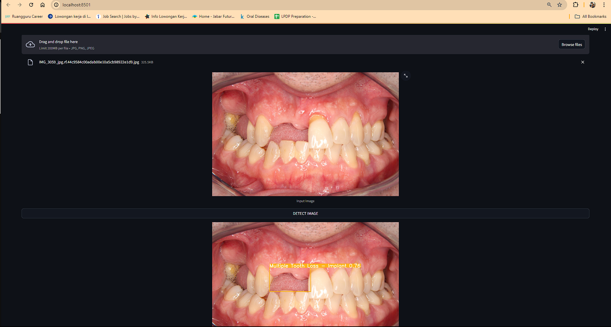
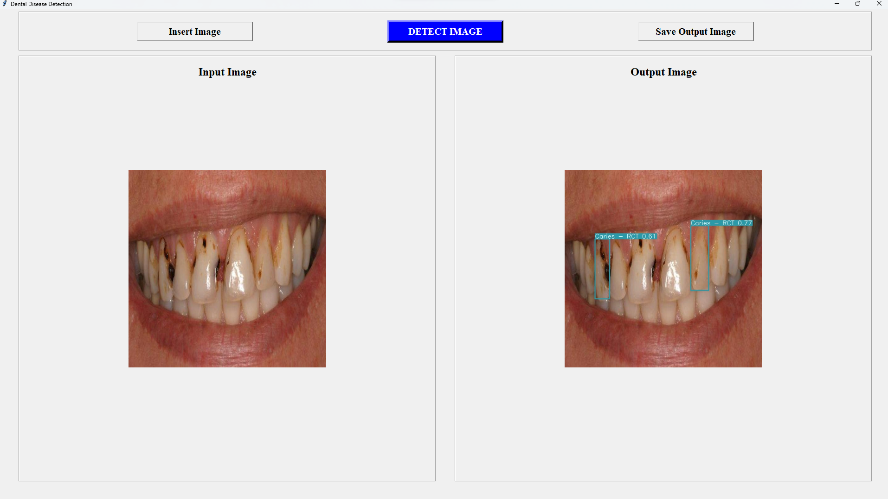

# Dental Disease Recognition

This repository contains streamlit app and flask api with python 3.9

## UI Development

Streamlit Web Apps
Tkinter GUI Desktop Apps

## Current Model

DETR (Failed)
YOLOv9 (Best Result)
YOLOv8 (Need to Re-train)
Faster RCNN (Need to Re-train)

### Dataset

Roboflow : https://universe.roboflow.com/andreasworkspace/dentalmates

## Demo Pics

### Home page

<figcaption>Streamlit Web Apps</figcaption>

<figcaption>Tkinter Desktop Apps</figcaption>

## Improvement Areas

- Validate datasets by expert (dentist)
- Re-training and try other model 
- Try using X-ray Images (later)

